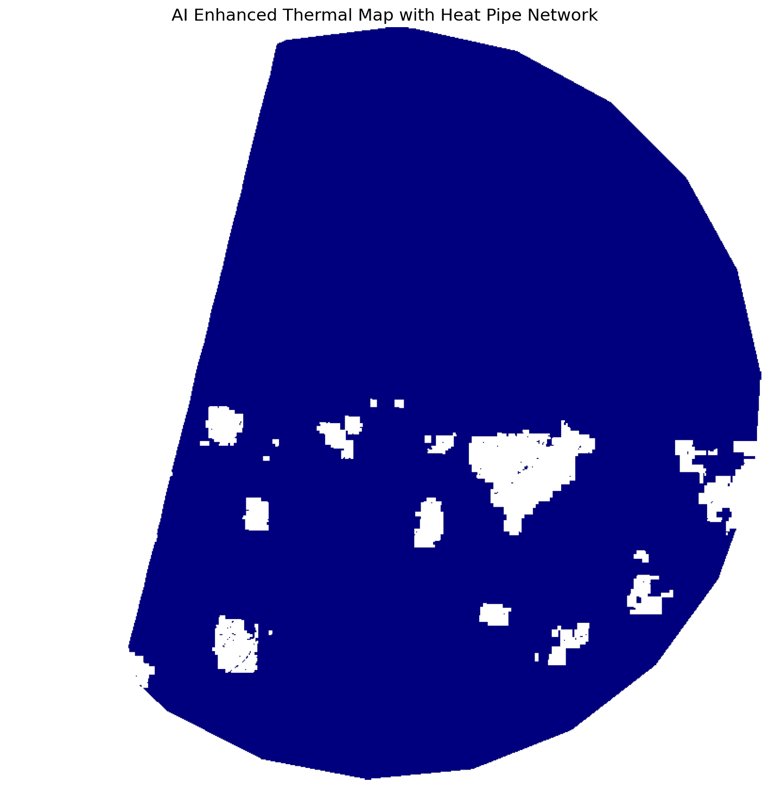
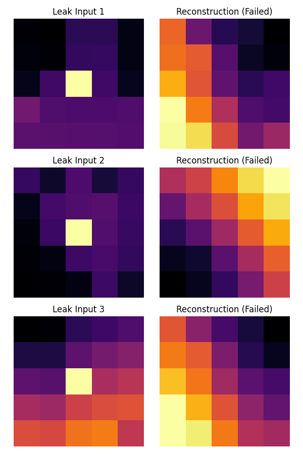
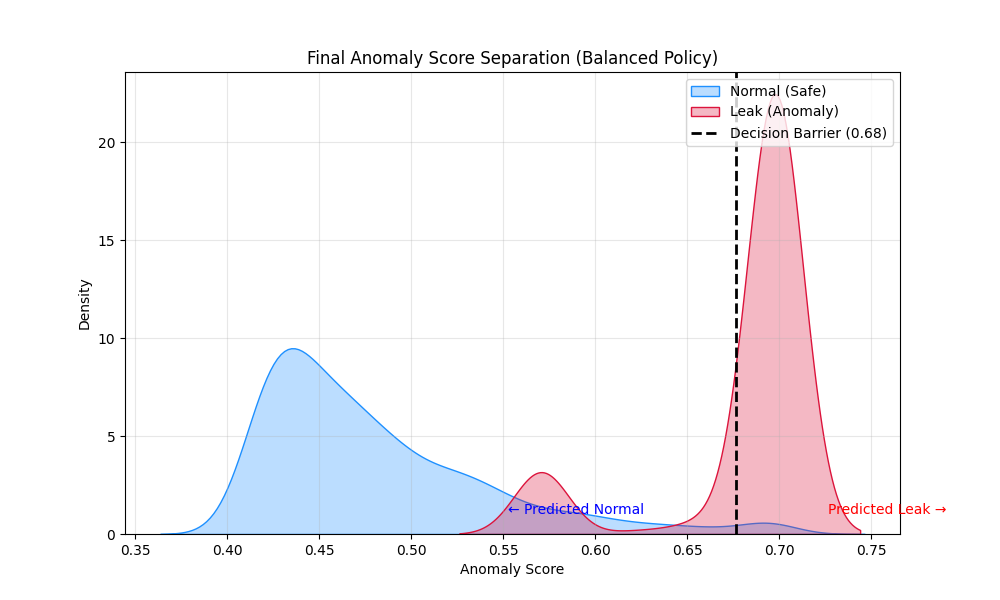

# HEATTRACK: Satellite-Based Thermal Leak Detection System

[](https://www.python.org/)
[](LICENSE)

**HEATTRACK** is an AI-driven geospatial analysis system designed to detect district heating pipe leaks using multi-source satellite imagery. By fusing Land Surface Temperature (LST) data from Landsat 8/9 with high-resolution Sentinel-2 optical data, the system achieves 10m-resolution thermal mapping to pinpoint potential anomalies in underground infrastructure.

## 🚀 Key Features

*   **Multi-Sensor Fusion**: Combines Landsat 8/9 (Thermal) and Sentinel-2 (Optical) to enhance thermal resolution (100m → 10m).
*   **AI-Driven Downscaling**: Utilizes NDVI-based sharpening and Deep Learning (MLP AutoEncoder) algorithms.
*   **Automated Anomaly Detection**: Unsupervised learning (Isolation Forest) to identify thermal hotspots deviating from the norm.
*   **Synthetic Data Generation**: Physics-informed simulator for generating pipe leak scenarios for model validation.

## 📊 Detection Results

The system successfully detects thermal anomalies in urban environments. Below are actual results from the analysis.

### 1. Thermal Anomaly Map
Downscaled thermal map (10m) overlaid with the pipe network. The model identifies high-risk areas (red) intersecting with district heating pipes (cyan).


### 2. AutoEncoder Reconstruction
The AutoEncoder learns the "normal" thermal patterns. When it tries to reconstruct a leak (anomaly), it fails, resulting in a high reconstruction error.


### 3. Anomaly Score Distribution
Separation of normal background data (Blue) and potential leak anomalies (Red) using the Isolation Forest model.


---

## 🏗 System Architecture

The pipeline consists of four main stages:

1.  **Data Acquisition**: Automated fetching of satellite imagery from Google Earth Engine (GEE).
2.  **Preprocessing**: Cloud masking, radiometric calibration, and coregistration.
3.  **Analysis**:
    *   *Downscaling*: Enhancing thermal map resolution.
    *   *Detection*: Identifying pipe network intersections with thermal anomalies.
4.  **Reporting**: Generating visual dashboards and risk maps.

## 📂 Project Structure

```bash
HEATTRACK/
├── configs/           # Configuration files
├── src/               # Core source code
│   ├── data/          # Data loaders & Synthetic generators
│   ├── models/        # AutoEncoder & Isolation Forest models
│   ├── processing/    # Downscaling & Preprocessing logic
│   └── visualization/ # Dashboard & Map generation
├── scripts/           # Utility scripts (training, evaluation)
├── docs/              # Documentation
└── notebooks/         # Jupyter Notebooks for experiments
```

## 💻 Installation

1.  **Clone the Repository**
    ```bash
    git clone https://github.com/your-username/HEATTRACK.git
    cd HEATTRACK
    ```

2.  **Set up Environment**
    ```bash
    # using conda
    conda create -n heattrack python=3.9
    conda activate heattrack
    
    # install dependencies
    pip install -r requirements.txt
    ```

3.  **Configuration**
    Copy the example config and edit it with your settings (e.g., Google Cloud Project ID).
    ```bash
    cp configs/config.example.yaml configs/config.yaml
    ```

## ⚡ Quick Start

**1. Generate Synthetic Pipe Network (Demo)**
Create a simulated pipe network for testing without restricted GIS data.
```bash
python -m src.main simulate
```

**2. Download Satellite Data**
Fetch the latest available satellite imagery for the target regions.
```bash
python -m src.main download
```

**3. Run Analysis Pipeline**
Propagate data through the downscaling and detection models.
```bash
python -m src.main pipeline
```

## 📊 Data & Reproducibility

*   **Satellite Data**: Sources from USGS (Landsat) and Copernicus (Sentinel-2) via Google Earth Engine.
*   **Pipe Data**: Due to security regulations, real underground facility maps cannot be shared. A **synthetic generator** (`src.data.synthetic`) is provided to create realistic mock data for reproduction.

## 🛡 License

This project is licensed under the MIT License - see the [LICENSE](LICENSE) file for details.

## 👥 Credits

Developed for the [Project Name/Course] by [Your Name/Team].
Special thanks to Korea District Heating Corp (KDHC) for domain insights.
